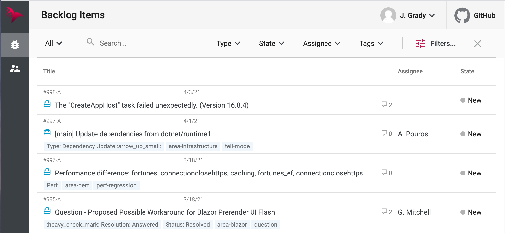

# Yet Another Bug Tracker (YABT)

 

 An educational project leveraging [RavenDB](https://ravendb.net) database and accompanied with a [series of articles](https://ravendb.net/news/use-cases/yabt-series) explaining various aspects of building bespoke enterprise apps with NoSQL.
 
 Available live at [yabt.ravendb.net](https://yabt.ravendb.net) (and API at [yabt.ravendb.net/swagger](https://yabt.ravendb.net/swagger/index.html)). Feel free to poke around!

## Technologies
* ASP .NET Core 5
* RavenDB 5.3
* Angular 12

It has minimum third-party dependencies and heaps of best practices.

## Get it up locally

1. Check out the GIT repo.
2. Get the back-end running (see [steps in 'back-end/README'](./back-end/)).
3. Get the front-end running (see [steps in 'front-end/README'](./front-end/)).

## Support

If you spot a bug, have an idea or a question, please let us know by [raising a new issue](https://github.com/ravendb/samples-yabt/issues/new), submitting a [pull request](https://docs.github.com/en/github/collaborating-with-issues-and-pull-requests/creating-a-pull-request) or contacting the author on Twitter @ [_AlexKlaus](https://twitter.com/_AlexKlaus).

## License

This project is licensed with the [MIT license](LICENSE).
