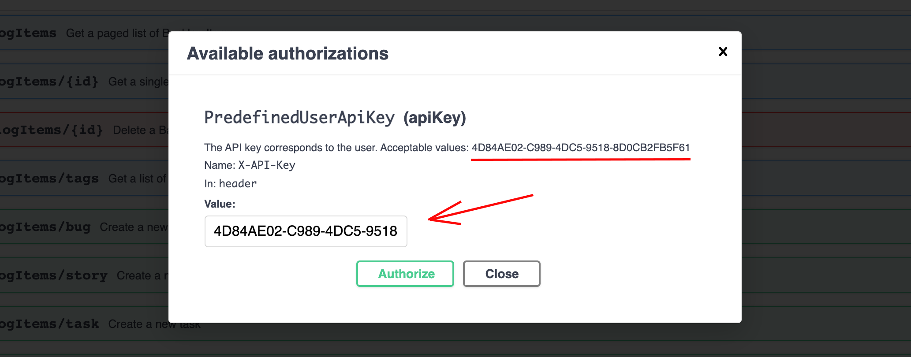

# YABT. Back-end

## Technologies
* ASP .NET Core 5.0
* RavenDB 5.1
* xUnit, NSubstitute

## Overview of the solution

|Project name|Description|
| ---------- | ----------|
|Database|All entities and aggregates, related classes and enums, plus DB-related settings.|
|Domain|All interfaces, types and logic specific to the domain layer.|
|WebAPI|The application layer (WebAPI).|

NOTE: all tests are located under `./tests` folder. |Domain.Tests|Automation of test scenarios applying Behavior Driven Tests (BDT).|

## Getting Started
Firstly, check out the GIT repo.

### Compile and run the tests

1. Install [.NET SDK](https://dotnet.microsoft.com/download) v5.x. 
Note that while the back-end would run on any version of .NET 5, the embedded _RavenDB_ used for the test project has a strong dependency on the _.NET SDK_ version. Check the required version in the [GitHub Action](./.github/workflows/dotnet-core.yml) used to run tests.

2. Open the solution and run the tests located under `./tests` folder. 
The tests that work against a real embedded _RavenDB_ database and cover multiple scenarios.

### Run Web API (Swagger)
Once you can run tests of the solutions, it's time to spin off a database and run the API.

1. Setup the database:
    1. Acquire a _RavenDB_ instance . Use on of the free options:
        1. free [cloud](https://cloud.ravendb.net/) instance;
        2. [download](https://ravendb.net/download) and install locally for your OS or Docker.
    2. Create a new database on the _RavenDB_ server ([see the docs](https://ravendb.net/docs/article-page/latest/csharp/studio/server/databases/create-new-database/general-flow)).
    3. Import test data from `./back-end/documentation/exported_data.ravendbdump` file ([see the docs](https://ravendb.net/docs/article-page/latest/csharp/studio/database/tasks/import-data/import-data-file))
    4. Set the address to the _RavenDB_ server and the DB name in `./back-end/WebApi/appsettings.Development.json`.
2. Launch the solution (the `WebAPI` project).
3. Open `https://localhost:5001/swagger` in the browser.

There is an unsophisticated authentication via a hard-coded API key to run the API end-points. Read a note in the Swagger prompt - it has a clue:

From here, the back-end is all yours.

Check out [notes on the front-end](../front-end/READM.md) if you'd like to run Angular UI as well.